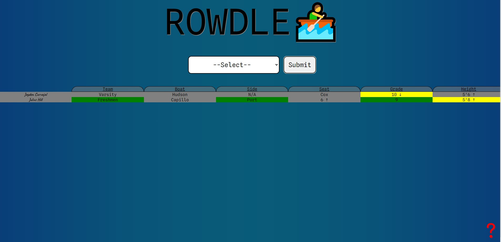
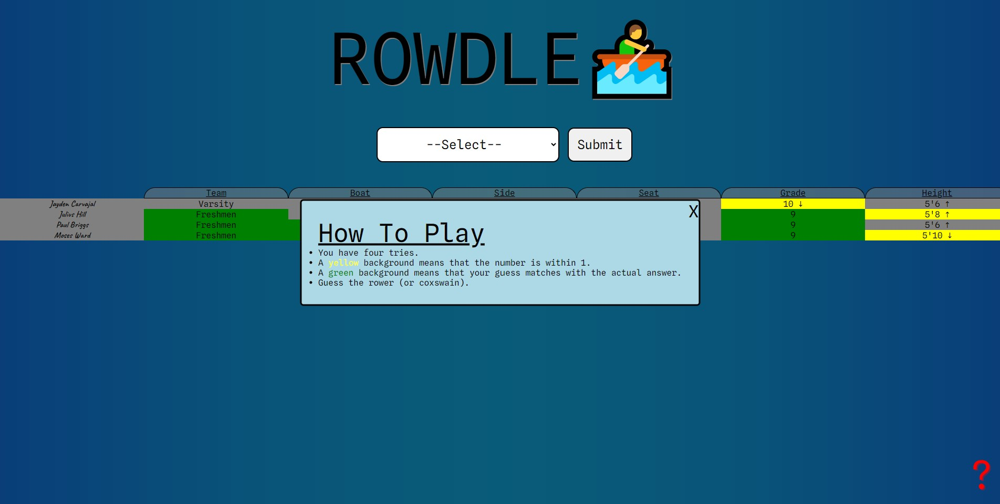

# Rowdle
When the puzzle game Wordle was taking the world by storm, I decided to make a version of the game that was very personal to me and my close friends. 

Rowdle!!! A game where you had to guess the crew team member in 4 tries!

## How To Play
 - Using the metrics given like seat number and height, the player has to try to guess who the rowdle was in 4 guesses.

   Some Gameplay:
   

 - A more detailed explanation of the rules:
   

## Privacy
 - For privacy reasons, all names have been changed using a random name generator (except mine).
 - This is also why there is no link to the game.
